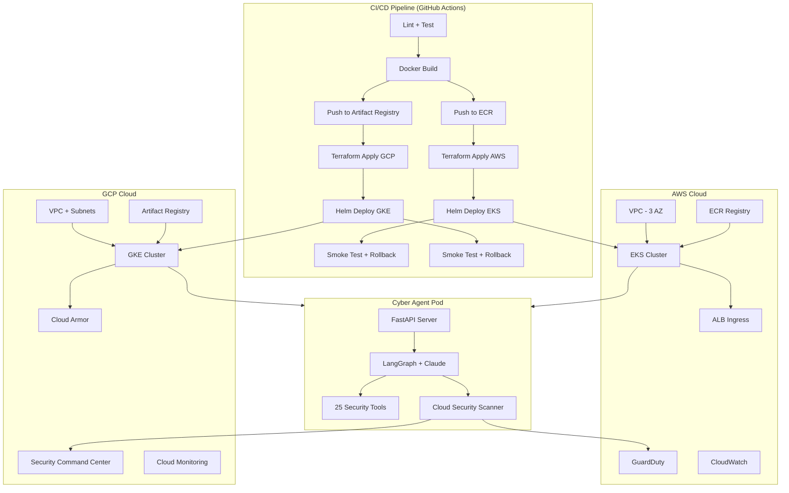

# Cybersecurity AI Agent

[](https://github.com/sasikumarIT10/cyber-agent/actions/workflows/deploy.yml)

An AI-powered cybersecurity automation platform built with **LangGraph**, **Anthropic Claude**, and **FastAPI** — deployed on **AWS EKS** and **GCP GKE** with full Infrastructure-as-Code, Kubernetes orchestration, and CI/CD pipelines.

## Tech Stack

| Layer | Technology |
|-------|-----------|
| **AI/LLM** | LangGraph, Anthropic Claude, LangChain |
| **Backend** | FastAPI, Python 3.11, Uvicorn |
| **Cloud (AWS)** | EKS, ECR, VPC, ALB, GuardDuty, Security Hub, CloudWatch |
| **Cloud (GCP)** | GKE, Artifact Registry, Cloud Armor, Security Command Center |
| **IaC** | Terraform (modular, dual-cloud) |
| **Orchestration** | Kubernetes, Helm, HPA, NetworkPolicy, PDB |
| **CI/CD** | GitHub Actions (build → push → terraform → helm → smoke test) |
| **Containerization** | Docker (multi-stage, non-root, health checks) |
| **Monitoring** | CloudWatch, GCP Cloud Monitoring, Prometheus |

## Architecture



## Security Tools (25 Total)

### Core Security
| Tool | Description |
|------|-------------|
| CVE Search | Search NIST NVD for vulnerabilities by keyword or CVE ID |
| Port Scanner | Scan targets for open ports with service detection |
| DNS Recon | DNS lookups, reverse DNS, SPF/DMARC security checks |
| IP Reputation | Check IPs against AbuseIPDB and VirusTotal |
| Domain Reputation | Check domains against VirusTotal threat feeds |
| Log Analyzer | Detect brute force, SQLi, XSS, command injection |
| Hash Checker | Check file hashes against malware databases |
| WHOIS Lookup | Domain/IP registration information |
| Geolocation | IP geolocation with hosting/proxy detection |

### Cloud Security
| Tool | Description |
|------|-------------|
| AWS GuardDuty | List findings, analyze threat intel |
| AWS Security Hub | Findings summary by severity |
| GCP SCC | Security Command Center findings and vulnerabilities |
| GCP Asset Inventory | Cloud Asset Inventory queries |
| K8s RBAC Audit | Detect overly permissive roles and bindings |
| K8s Pod Security | Audit pod security contexts and misconfigs |
| K8s Exposed Services | Find externally exposed LoadBalancer/NodePort services |
| K8s Image Audit | Detect untagged or latest-tag images |
| AWS IAM Audit | Find admin users, missing MFA, stale access keys |
| GCP IAM Audit | Detect primitive roles, public access, SA misuse |
| Cross-Cloud IAM | Combined AWS + GCP IAM posture comparison |

## Project Structure

```
├── cyber_agent/                    # Main application
│   ├── agent/                      # LangGraph AI engine
│   │   ├── graph.py               # Agent orchestration (RAO loop)
│   │   ├── state.py               # Agent state schema
│   │   ├── prompts.py             # System prompts
│   │   └── skills_loader.py       # 762-skill knowledge base loader
│   ├── tools/                      # Security tools
│   │   ├── cloud_aws.py           # GuardDuty, Security Hub
│   │   ├── cloud_gcp.py           # SCC, Asset Inventory
│   │   ├── cloud_k8s.py           # RBAC, Pod Security, Services
│   │   ├── cloud_iam.py           # IAM analysis (AWS + GCP)
│   │   ├── cve_lookup.py          # CVE/NVD search
│   │   ├── port_scanner.py        # Network scanning
│   │   ├── dns_recon.py           # DNS reconnaissance
│   │   ├── ip_reputation.py       # IP/Domain reputation
│   │   ├── log_analyzer.py        # Log analysis
│   │   ├── hash_checker.py        # Malware hash checking
│   │   └── network_utils.py       # WHOIS, geolocation
│   ├── infrastructure/             # Terraform IaC
│   │   ├── modules/
│   │   │   ├── networking/        # VPC, subnets, NAT (AWS & GCP)
│   │   │   ├── eks-cluster/       # EKS + node groups + IRSA + KMS
│   │   │   ├── gke-cluster/       # GKE + Workload Identity + Cloud Armor
│   │   │   ├── container-registry/# ECR + Artifact Registry
│   │   │   └── monitoring/        # CloudWatch + Cloud Monitoring
│   │   └── environments/
│   │       ├── aws/               # AWS production config
│   │       └── gcp/               # GCP production config
│   ├── k8s/                        # Kubernetes deployment
│   │   └── helm-chart/
│   │       ├── templates/         # Deployment, HPA, NetworkPolicy, PDB
│   │       ├── values-aws.yaml    # EKS overrides (ALB, IRSA)
│   │       └── values-gcp.yaml    # GKE overrides (Workload Identity)
│   ├── .github/workflows/         # CI/CD
│   │   └── deploy.yml             # Full pipeline
│   ├── Dockerfile                  # Multi-stage build
│   ├── docker-compose.yml          # Local dev environment
│   ├── api.py                      # FastAPI REST API + Web server
│   ├── cli.py                      # Rich CLI interface
│   └── web/index.html              # Browser dashboard
│
└── Cybersecurity-Skills/           # 762 cybersecurity skill procedures
    ├── skills/                     # Skill definitions
    └── mappings/                   # MITRE ATT&CK + NIST CSF mappings
```

## Quick Start

### Option 1: Docker (Fastest)

```bash
cd cyber_agent
cp .env.example .env
# Add your ANTHROPIC_API_KEY to .env
docker-compose up -d
# Open http://localhost:8000
```

### Option 2: Local Python

```bash
cd cyber_agent
python -m venv venv
venv\Scripts\activate        # Windows
# source venv/bin/activate   # Linux/macOS
pip install -r requirements.txt
cp .env.example .env
# Add your ANTHROPIC_API_KEY to .env

python api.py                # Web UI at http://localhost:8000
python cli.py chat           # Interactive CLI
```

### Option 3: Deploy to AWS EKS

```bash
cd cyber_agent/infrastructure/environments/aws
cp terraform.tfvars.example terraform.tfvars
# Edit terraform.tfvars
terraform init && terraform apply

aws eks update-kubeconfig --name cyber-agent-prod --region us-east-1
helm upgrade --install cyber-agent ../../k8s/helm-chart \
  -f ../../k8s/helm-chart/values-aws.yaml \
  --set secrets.anthropicApiKey=YOUR_KEY
```

### Option 4: Deploy to GCP GKE

```bash
cd cyber_agent/infrastructure/environments/gcp
cp terraform.tfvars.example terraform.tfvars
# Edit terraform.tfvars
terraform init && terraform apply

gcloud container clusters get-credentials cyber-agent-prod --region us-central1
helm upgrade --install cyber-agent ../../k8s/helm-chart \
  -f ../../k8s/helm-chart/values-gcp.yaml \
  --set secrets.anthropicApiKey=YOUR_KEY
```

## CI/CD Pipeline

The GitHub Actions workflow automates the full deployment:

```
Push to main → Lint/Test → Docker Build → Push to ECR + Artifact Registry
                                        → Terraform Plan/Apply
                                        → Helm Deploy to EKS + GKE
                                        → Smoke Test (auto-rollback on failure)
```

Required GitHub Secrets:
- `AWS_ACCESS_KEY_ID`, `AWS_SECRET_ACCESS_KEY`
- `GCP_SA_KEY`, `GCP_PROJECT_ID`
- `ANTHROPIC_API_KEY`

## API Endpoints

| Method | Endpoint | Description |
|--------|----------|-------------|
| GET | `/` | Web dashboard |
| GET | `/health` | Health check |
| POST | `/api/chat` | AI agent query |
| POST | `/api/scan` | Port scan |
| POST | `/api/cve` | CVE search |
| POST | `/api/dns` | DNS recon |
| POST | `/api/reputation` | IP/Domain reputation |
| POST | `/api/logs/analyze` | Log analysis |
| GET | `/docs` | Swagger API docs |

## Configuration

| Variable | Required | Description |
|----------|----------|-------------|
| `ANTHROPIC_API_KEY` | Yes | Claude API key |
| `VIRUSTOTAL_API_KEY` | No | VirusTotal hash/domain checks |
| `ABUSEIPDB_API_KEY` | No | IP reputation scoring |
| `AWS_REGION` | No | AWS region for cloud tools |
| `GCP_PROJECT_ID` | No | GCP project for cloud tools |

## Skills Library

Integrates with **762 cybersecurity skill procedures** covering 26+ security domains, mapped to MITRE ATT&CK and NIST CSF frameworks. The agent automatically loads relevant procedures as context for deeper analysis.

## License

For authorized security testing and research only.
